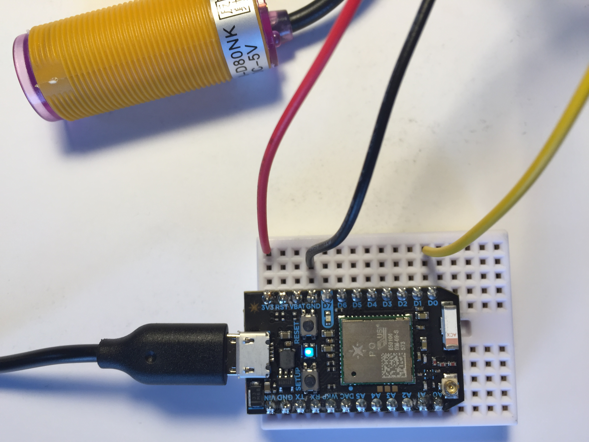

# ir2

*detects distance using infrared light*

Product: [Infrared Distance Ranging Sensor](http://www.14core.com/wiring-the-e18-d80nk-infrared-distance-ranging-sensor/)

#### Tools needed: 

- Particle Photon or Electron
- Hook up wires

## Setup

[[INSTRUCTIONS](http://www.14core.com/wiring-the-e18-d80nk-infrared-distance-ranging-sensor/)]



## Starter Code

*Adapted from an example in the [Particle docs](https://docs.particle.io/guide/getting-started/examples/photon/#read-your-photoresistor-function-and-variable)*

``` cpp
// -----------------------------------------
// IR sensor
// -----------------------------------------

// In this example, we're going to register a Particle.variable() with the cloud so that we can read the status of an IR sensor.

int ir = D0; // This is the input pin where you read the value of the sensor.

int analogvalue; // Here we are declaring the integer variable analogvalue, which we will use later to store the value of the sensor.

void setup() {

    // This lets the device know which pin will be used to read incoming voltage.
    pinMode(ir,INPUT);  // Our sensor pin is input (reading the sensor)

    // We are going to declare a Particle.variable() here so that we can access the value of the sensor from the cloud.
    Particle.variable("analogvalue", &analogvalue, INT);
    // This is saying that when we ask the cloud for "analogvalue", this will reference the variable analogvalue in this app, which is an integer variable.

}

void loop() {

    if (digitalRead(ir) == HIGH) {

        // =0 if no IR detected
        analogvalue = 0;
        
    }
    
    else {

        // =1 if IR detected in past 5 seconds
        analogvalue = 1;
        delay(5000);

    }
    
}
```

