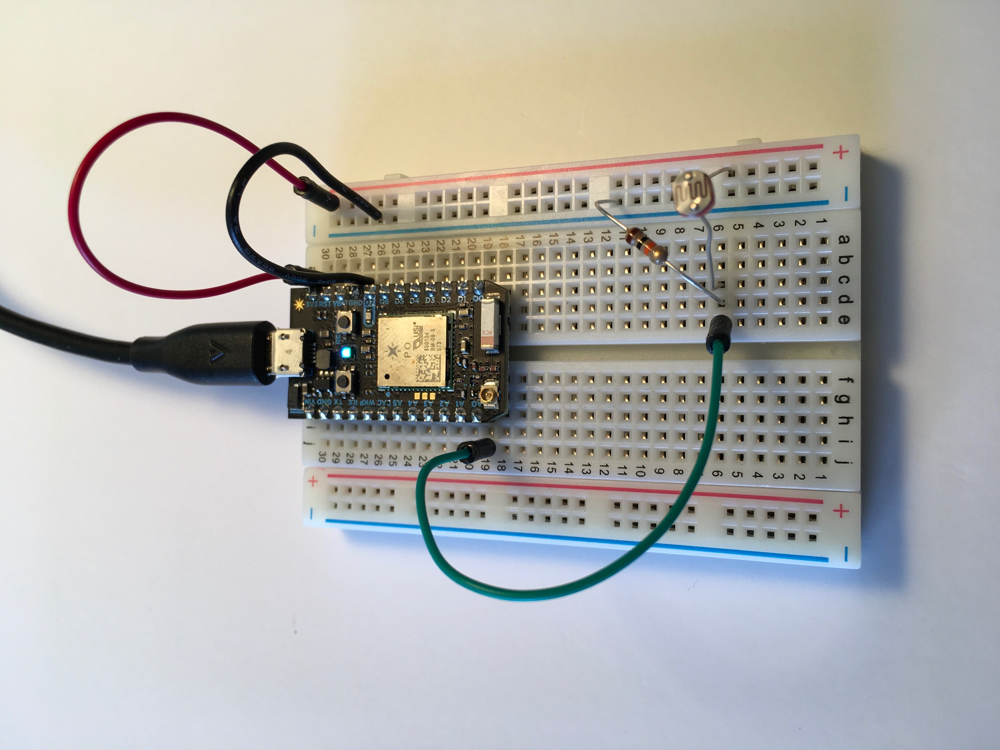
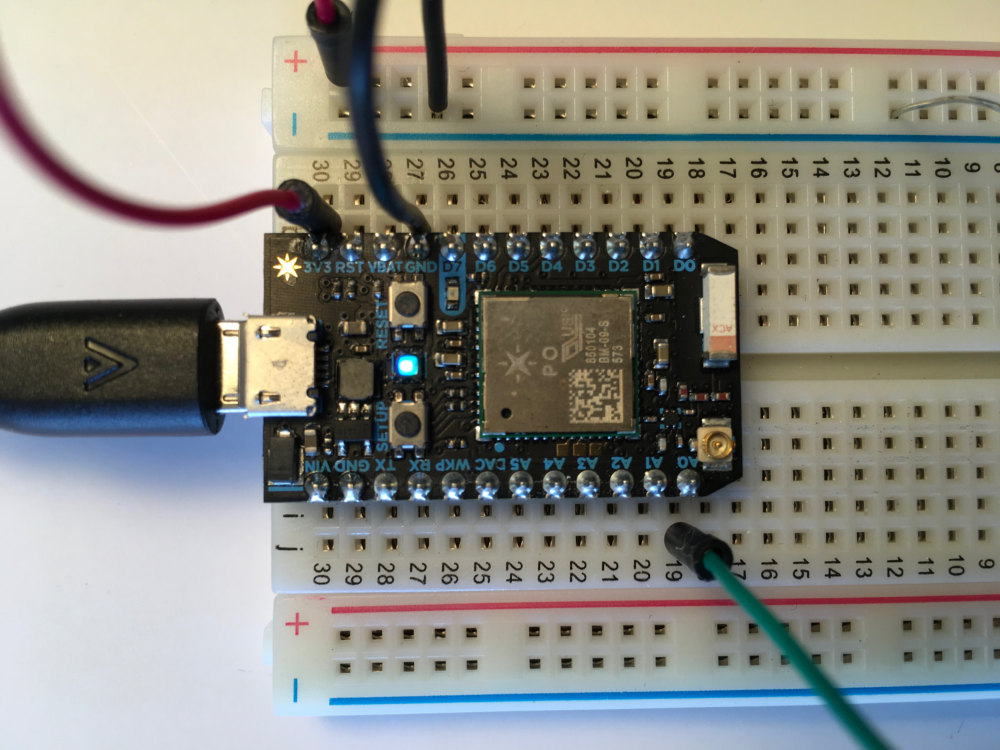

# photocell

## Setup




## Starter Code

```
// -----------------------------------------
// Function and Variable with Photoresistors
// -----------------------------------------
// In this example, we're going to register a Particle.variable() with the cloud so that we can read brightness levels from the photoresistor.
// We'll also register a Particle.function so that we can turn the LED on and off remotely.

// We're going to start by declaring which pins everything is plugged into.

int photoresistor = A0; // This is where your photoresistor is plugged in. The other side goes to the "power" pin (below).

// int power = A5; // This is the other end of your photoresistor. The other side is plugged into the "photoresistor" pin (above).
// The reason we have plugged one side into an analog pin instead of to "power" is because we want a very steady voltage to be sent to the photoresistor.
// That way, when we read the value from the other side of the photoresistor, we can accurately calculate a voltage drop.

int analogvalue; // Here we are declaring the integer variable analogvalue, which we will use later to store the value of the photoresistor.

// Next we go into the setup function.

void setup() {

    // First, declare all of our pins. This lets our device know which ones will be used for outputting voltage, and which ones will read incoming voltage.
    pinMode(photoresistor,INPUT);  // Our photoresistor pin is input (reading the photoresistor)
    // pinMode(power,OUTPUT); // The pin powering the photoresistor is output (sending out consistent power)

    // Next, write one pin of the photoresistor to be the maximum possible, so that we can use this for power.
    // digitalWrite(power,HIGH);

    // We are going to declare a Particle.variable() here so that we can access the value of the photoresistor from the cloud.
    Particle.variable("analogvalue", &analogvalue, INT);
    // This is saying that when we ask the cloud for "analogvalue", this will reference the variable analogvalue in this app, which is an integer variable.

}

// Next is the loop function...

void loop() {

    // check to see what the value of the photoresistor is and store it in the int variable analogvalue
    analogvalue = analogRead(photoresistor);
    delay(100);
}
```